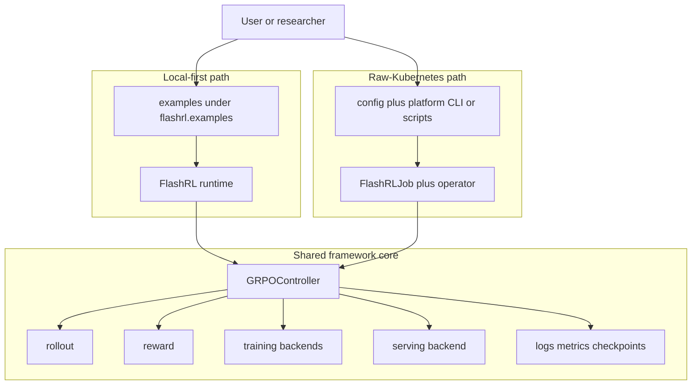

# FlashRL

FlashRL is a learning-first RL project for LLM post-training.

It is built for two closely related use cases:

- local-first experimentation with explicit examples, whitebox agents, and GRPO-based training
- raw-Kubernetes execution where the same framework runtime is rendered into a `FlashRLJob` and run as a small distributed system

Today the repo has two primary paths:

- local-first RL and agent experimentation through explicit example modules
- raw-Kubernetes platform execution by rendering and applying one `FlashRLJob`

## What FlashRL Is Today

- a generic `FlashRL` runtime with a GRPO controller for actor, reference, serving, rollout, and reward roles
- a public agent-building toolbox under `flashrl.framework.agent`
- a local example ladder that starts with minimal agent loops and grows into a coding-oriented reference harness plus ablation workflow
- training examples such as `math` and `code_single_turn`
- GRPO loss preset documentation under `docs/`
- a raw-Kubernetes platform path with both CLI-driven render/apply flows and helper scripts

## Architecture At A Glance



See [docs/overview.md](docs/overview.md) for the higher-level project diagram
and [docs/platform-architecture.md](docs/platform-architecture.md) for the
Kubernetes-specific view.

## Core Runtime Model

Whether you run FlashRL locally or through Kubernetes, the same core training
shape shows up:

| Component | Responsibility |
| --- | --- |
| `FlashRL` | top-level runtime assembly and lifecycle for one run |
| `GRPOController` | owns the RL loop, batching, optimization, and coordination |
| rollout | generates model responses from prompts |
| reward | scores rollouts and produces reward signals |
| training backends | own mutable actor weights and optional reference weights |
| serving backend | serves inference for rollout generation and weight activation |
| observability | logs, metrics, checkpoints, and admin/runtime state |

The important conceptual split is:

- local mode wires these pieces together inside one user-facing workflow
- platform mode wraps the same pieces in operator, pod, and service machinery
- examples are not separate from the framework; they are the main way FlashRL
  demonstrates how to assemble and run the framework

## Project Layout

The repo is easiest to navigate if you treat it as five top-level surfaces:

| Path | What it contains |
| --- | --- |
| `flashrl/framework` | core runtime, controller, training, serving, rollout, reward, observability, and agent primitives |
| `flashrl/examples` | public example ladder and training examples |
| `flashrl/platform` | Kubernetes config compiler, CRD/operator code, and pod runtime shims |
| `docs` | architecture notes, GRPO preset documentation, and design references |
| `scripts` | platform helpers, plotting scripts, and local smoke utilities |

## Install

Default local development:

```bash
pip install -e '.[dev]'
```

Add managed local vLLM serving when needed:

```bash
pip install -e '.[dev,vllm]'
```

Add Kubernetes platform support when needed:

```bash
pip install -e '.[dev,platform]'
```

If you need both optional paths:

```bash
pip install -e '.[dev,vllm,platform]'
```

Typical intent mapping:

- local examples and development: `.[dev]`
- local examples with managed vLLM serving: `.[dev,vllm]`
- Kubernetes workflow work: `.[dev,platform]`
- full contributor environment: `.[dev,vllm,platform]`

## Start Here

Examples are module-first entrypoints under `flashrl.examples`.

Start with the primary agent ladder:

| Example | What it gives you |
| --- | --- |
| `agent_tools` | Smallest explicit whitebox agent loop with fixed tools |
| `agent_dynamic_tools` | Dynamic tool gating and context-aware tool visibility |
| `agent_harness` | Reference coding-oriented harness assembled from the generic agent primitives |
| `agent_harness_ablation` | Controlled comparison workflow for harness variants |

Additional training examples:

- `math`: training-integrated whitebox rollout example with local and platform paths
- `code_single_turn`: single-turn code reasoning baseline

The fastest way to orient yourself is:

1. read [flashrl/examples/README.md](flashrl/examples/README.md)
2. run one small local example such as `agent_tools`
3. move to `agent_harness`, `math`, or `code_single_turn` depending on your goal
4. switch to [flashrl/platform/README.md](flashrl/platform/README.md) only when you need the Kubernetes path

The best detailed starting point is still
[flashrl/examples/README.md](flashrl/examples/README.md).

## CLI Surface

The top-level `flashrl` CLI is currently platform-oriented:

```text
flashrl platform ...
flashrl controller
flashrl rollout
flashrl reward
flashrl learner
flashrl serving
```

Interpretation:

- `flashrl platform ...` is the public entrypoint for rendering, submitting,
  inspecting, and operating `FlashRLJob` runs
- `flashrl controller|rollout|reward|learner|serving` are the pod runtime
  entrypoints used by platform mode
- local example runs are usually launched with `python3 -m flashrl.examples...`
  rather than through the top-level CLI

## Local Workflows

For local work, start with the examples README and run the example module
entrypoints directly.

Representative commands:

```bash
python3 -m flashrl.examples.agent_tools.run
python3 -m flashrl.examples.agent_harness.train
python3 -m flashrl.examples.math.train
python3 -m flashrl.examples.code_single_turn.train
```

Common local progression:

1. `agent_tools`
   Learn the smallest explicit whitebox agent loop.
2. `agent_dynamic_tools`
   Add dynamic tool gating and context control.
3. `agent_harness`
   Move to a more realistic coding-oriented reference system.
4. `math` or `code_single_turn`
   Use training examples that exercise the same runtime with different rollout
   and reward shapes.

Example config layout is consistent where examples ship configs:

- `config.yaml` is the normal default config
- `config-vllm.yaml` is the managed local vLLM variant when available

Important local notes:

- examples are module-first and keep their own small docs next to the code
- some examples ship both train and eval entrypoints
- when an example uses `serving.backend: vllm`, the example entrypoint may
  auto-fill `FLASHRL_VLLM_PYTHON` when a prepared runtime is available
- cluster smoke configs live under `flashrl/platform/dev/`, not under the
  public example directories

Detailed example-specific train and eval commands live in the per-example docs.

## Kubernetes Platform Workflow

FlashRL platform mode is raw-Kubernetes first. The main model is:

1. build images
2. render one `FlashRLJob` from an explicit config
3. apply it with `kubectl`
4. inspect status and logs

Platform mode is not a second training stack. It is the same framework runtime
wrapped in:

- a config compiler that turns `config.yaml` into a validated `FlashRLJob`
- a Kubernetes operator that reconciles the job
- pod runtime shims for controller, rollout, reward, learner, and serving
- per-job log roots and CRD-backed status reporting

The repo also ships helper scripts for the common workflow:

```bash
IMAGE_REGISTRY=ghcr.io/me/flashrl-dev \
  bash scripts/build_platform_images.sh

bash scripts/run_platform_job.sh \
  --config flashrl/examples/math/config.yaml \
  --image-env-file logs/platform-images/<tag>/flashrl-images.env

bash scripts/cleanup_platform.sh
```

Minimal manual render/apply flow:

```bash
python3 -m flashrl platform render \
  --config flashrl/examples/math/config.yaml \
  --output flashrl-job.yaml

kubectl apply -f flashrl-job.yaml
python3 -m flashrl platform logs flashrl-math-demo --namespace default
```

Useful platform commands:

```bash
python3 -m flashrl platform status flashrl-math-demo --namespace default
python3 -m flashrl platform describe flashrl-math-demo --namespace default
python3 -m flashrl platform cancel flashrl-math-demo --namespace default
```

What the platform path adds beyond local mode:

- explicit image and workload boundaries
- `FlashRLJob` rendering and reconciliation
- controller-to-service communication through distributed clients and service apps
- durable per-job and per-pod runtime logs

Use [flashrl/platform/README.md](flashrl/platform/README.md) for the full
platform workflow, image modes, operator lifecycle, and minikube smoke path.

## Docs

- [docs/overview.md](docs/overview.md): project-level architecture and the split between local and platform paths
- [flashrl/examples/README.md](flashrl/examples/README.md): example ladder, module-first commands, and example config conventions
- [flashrl/framework/agent/README.md](flashrl/framework/agent/README.md): public agent-building blocks and mental model
- [flashrl/platform/README.md](flashrl/platform/README.md): raw-Kubernetes platform workflow and code map
- [docs/platform-architecture.md](docs/platform-architecture.md): platform architecture and workload boundaries
- [docs/grpo-loss-presets.md](docs/grpo-loss-presets.md): implemented GRPO loss building blocks and preset matrix
- [docs/weight-sync.md](docs/weight-sync.md): training-to-serving weight synchronization design

If you only read three pages after this README, use:

1. [flashrl/examples/README.md](flashrl/examples/README.md)
2. [docs/overview.md](docs/overview.md)
3. [flashrl/platform/README.md](flashrl/platform/README.md)

## Observability

TensorBoard is the default local metrics path:

```bash
tensorboard --logdir logs
```

The optional local metrics stack is still available:

```bash
./dev.sh metrics up
./dev.sh metrics down
./dev.sh metrics reset
```

Platform-side job logs are available through the CLI:

```bash
python3 -m flashrl platform logs flashrl-math-demo --namespace default
```

The observability model is:

- local runs write under `logs/`
- platform runs resolve to one shared job-scoped log root
- controller run artifacts and pod runtime logs both remain inspectable
- metrics can stay purely local or be pushed into the optional local stack

Useful local URLs:

- Grafana: `http://localhost:3000`
- Prometheus: `http://localhost:9090`
- Pushgateway: `http://localhost:9091`
