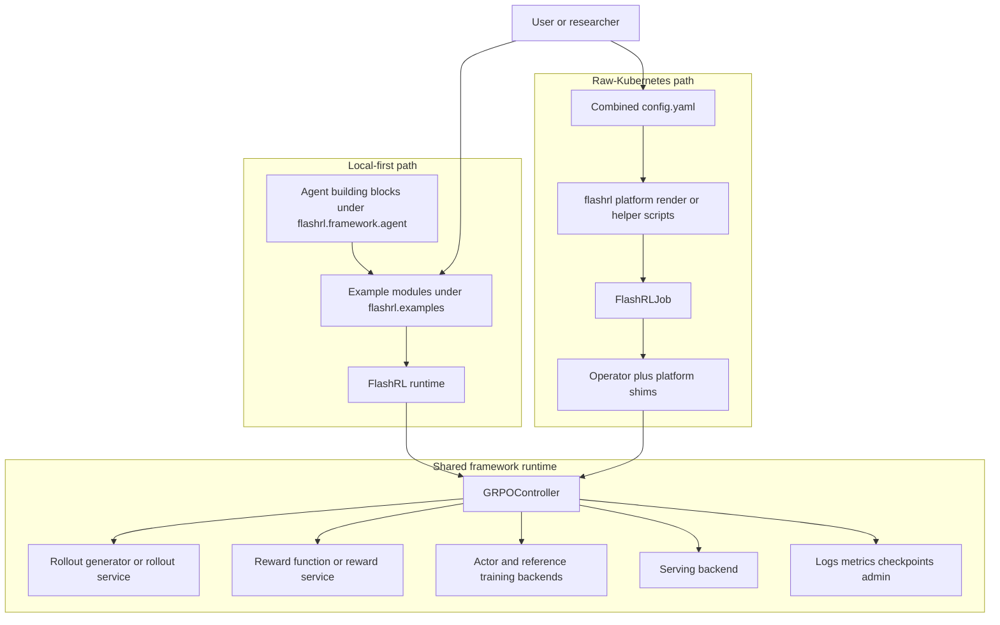
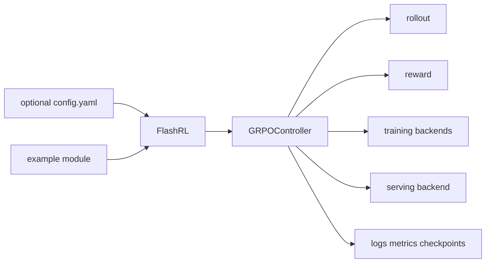
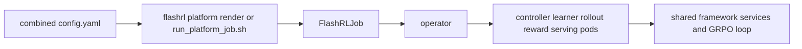

# FlashRL Overview

This page is the shortest project-level architecture view for FlashRL.

Use it to answer three questions quickly:

1. what are the two top-level ways of running FlashRL
2. which framework components are shared between those paths
3. where training, serving, rollout, reward, and observability fit

For the Kubernetes-specific system picture, use
[platform-architecture.md](platform-architecture.md). For the GRPO loss
surface, use [grpo-loss-presets.md](grpo-loss-presets.md).

## Architecture At A Glance

Interpretation:

- local examples and platform jobs are two entry paths into the same core training stack
- the shared center is the GRPO controller plus rollout, reward, training, serving, and observability components
- platform mode adds orchestration, job rendering, and pod bootstrapping around the same framework logic

## Local Path

The local-first path is centered on explicit example modules in
`flashrl.examples`.

- the agent ladder starts at `agent_tools` and grows into the assembled coding
  harness examples
- `math` and `code_single_turn` are training examples built on the same runtime
- examples either construct `FlashRL(...)` directly or route through explicit
  config files

Conceptually, the local path looks like this:

## Platform Path

The platform path wraps the same framework runtime in a raw-Kubernetes control
plane.

Interpretation:

- the operator manages Kubernetes objects
- the controller pod runs the GRPO loop
- rollout, reward, learner, and serving pods expose the services the controller uses
- detailed pod and image boundaries live in
  [platform-architecture.md](platform-architecture.md)

## Where To Go Next

- [../README.md](../README.md): repo landing page and top-level workflows
- [../flashrl/examples/README.md](../flashrl/examples/README.md): example ladder and module-first commands
- [../flashrl/framework/agent/README.md](../flashrl/framework/agent/README.md): public agent building blocks
- [platform-architecture.md](platform-architecture.md): Kubernetes architecture
- [weight-sync.md](weight-sync.md): training-to-serving sync details
- [grpo-loss-presets.md](grpo-loss-presets.md): GRPO preset behavior
