# FlashRL Platform Architecture

This page is the quickest way to build a mental model of FlashRL platform mode.
It focuses on three questions:

1. how many images exist and what each image is for
2. what logical layers live inside each image
3. how a `config.yaml` turns into running training on Kubernetes

## Mental Model

There are four separate concerns in platform mode:

- local CLI and config compilation
  This is where `flashrl platform render` or `flashrl platform submit` runs.
- operator control plane
  This is the long-lived Kubernetes controller that watches `FlashRLJob`.
- job workloads
  These are the controller, learner, serving, rollout, and reward pods created for one job.
- framework service layer
  These are the HTTP servers and clients inside the pods that actually move rollout, reward, optimize, and serve requests.

The important split is:

- the operator manages Kubernetes objects
- the controller pod runs training
- the other job pods expose services the controller talks to

## What Runs Where

Workload to image mapping:

- `flashrl-operator`
  Runs the Kubernetes operator deployment only.
- `flashrl-runtime`
  Runs the job controller, rollout, and reward pods.
- `flashrl-serving-vllm`
  Runs the serving pod.
- `flashrl-training-fsdp`
  Runs the learner pod.

That means there is no separate controller image. Controller, rollout, and reward share the runtime image.

## What Platform Adds Per Pod

| Pod | Platform software in the pod | What platform adds | Framework software used | User hook or backend |
| --- | --- | --- | --- | --- |
| controller | `flashrl.platform.runtime.controller` | Load mounted `FlashRLJob`, resolve sibling service URLs, merge live CRD status, patch controller-owned status, resolve checkpoints, start background training loop | `RolloutClient`, `RewardClient`, `LearnerClient`, `ServingClient`, `GRPOTrainer`, controller status routes | dataset hook or dataset URI |
| rollout | `flashrl.platform.runtime.rollout` | Load mounted job, instantiate rollout hook, create remote serving client, wire rollout generator into the rollout service | `ServingClient`, `RemoteServingBackend`, `build_rollout_generator`, `RolloutService`, `create_rollout_service_app` | `userCode.rollout` |
| reward | `flashrl.platform.runtime.reward` | Load mounted job and instantiate the reward hook, then wire it into the reward service | `UserDefinedReward`, `RewardService`, `create_reward_service_app` | `userCode.reward` |
| learner | `flashrl.platform.runtime.learner` | Load mounted job, create actor/reference backends, resolve shared storage paths, publish learner artifacts | `create_training_backend`, `LearnerService`, `create_learner_service_app` | training backends from framework config |
| serving | `flashrl.platform.runtime.serving` | Load mounted job, resolve shared artifact paths, create the configured serving backend, expose serving RPCs | `create_serving_backend`, `ServingService`, `create_serving_service_app` | serving backend from framework config |

## Image Inventory

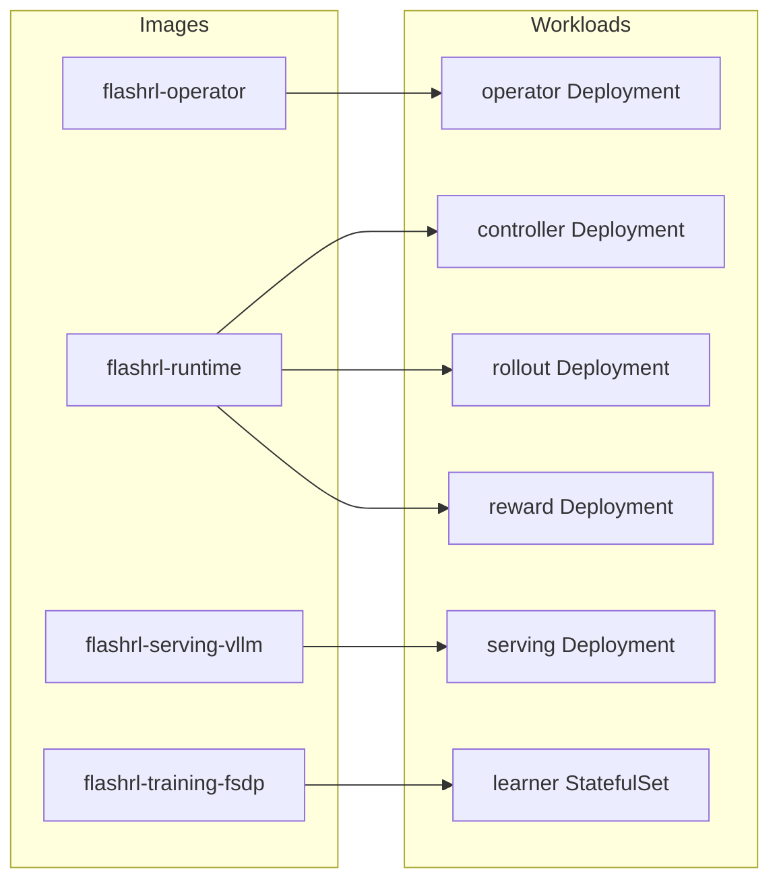

Interpretation: Kubernetes starts the operator from `flashrl-operator`. When the operator reconciles a `FlashRLJob`, it creates the controller, rollout, reward, learner, and serving workloads, each of which pulls one of the remaining three images.

## Layers Inside an Image

```mermaid
flowchart TB
    subgraph RuntimeImage[flashrl-runtime]
        R1[container ENTRYPOINT: flashrl]
        R2[pod command: controller or rollout or reward]
        R3[platform runtime bootstrap]
        R4[framework distributed server/client layer]
        R5[user hooks and framework logic]
        R1 --> R2 --> R3 --> R4 --> R5
    end

    subgraph ServingImage[flashrl-serving-vllm]
        S1[container ENTRYPOINT: flashrl]
        S2[pod command: serving]
        S3[platform runtime bootstrap]
        S4[framework serving server]
        S5[serving backend: huggingface or vllm]
        S1 --> S2 --> S3 --> S4 --> S5
    end

    subgraph TrainingImage[flashrl-training-fsdp]
        T1[container ENTRYPOINT: flashrl]
        T2[pod command: learner]
        T3[platform runtime bootstrap]
        T4[framework learner server]
        T5[training backend: huggingface or fsdp2]
        T1 --> T2 --> T3 --> T4 --> T5
    end

    subgraph OperatorImage[flashrl-operator]
        O1[container ENTRYPOINT: flashrl]
        O2[command: platform operator]
        O3[operator facade and reconcile loop]
        O4[Kubernetes API]
        O1 --> O2 --> O3 --> O4
    end
```

Interpretation: each image has a thin CLI/runtime entry layer on top of the real service or operator logic. The runtime images mostly bootstrap a concrete implementation and then hand off to the existing framework distributed server layer.

## Execution Workflow

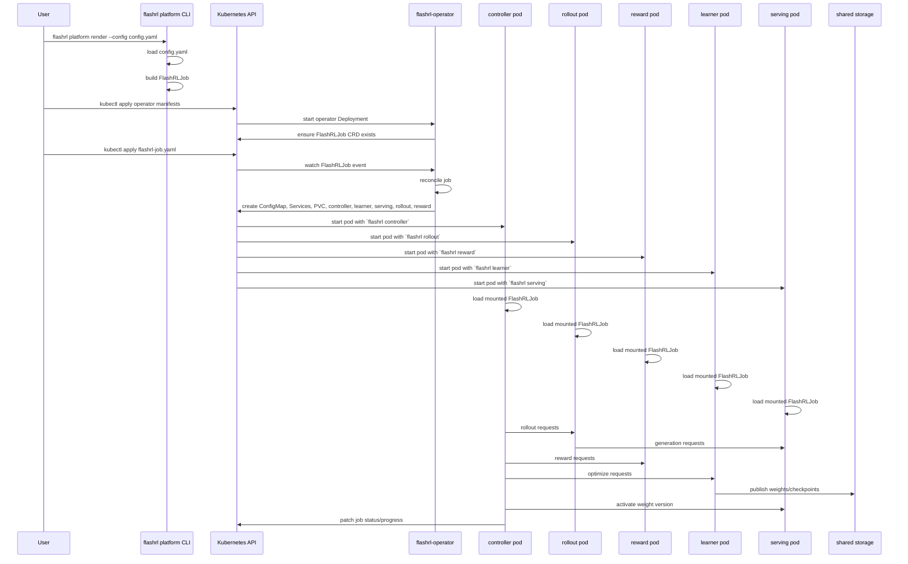

Interpretation: submitting a `FlashRLJob` does not itself run training. The operator reacts to the job, creates the workloads, and Kubernetes starts the pods. Training begins only after the controller pod comes up and its startup path launches the GRPO loop.

## Inside Each Pod

Every workload pod follows the same broad pattern:

1. Kubernetes starts the container with a `flashrl ...` command
2. `flashrl.platform.runtime` bootstraps the pod-specific implementation
3. `flashrl.framework.distributed` exposes the HTTP service surface
4. the hook or backend implementation does the real work

In the diagrams below:

- `pod contract` means `flashrl.platform.runtime.pod`
- `platform bootstrap` means one of `flashrl.platform.runtime.controller|rollout|reward|learner|serving`
- `framework` means `flashrl.framework.distributed` plus backend or hook code

### Controller Pod

The controller pod owns orchestration and training, so its runtime has both an init path and a long-running execution path.
Kubernetes naming: `container=controller`, workload/pod prefix=`<job>-controller`.
Platform modules: `flashrl.platform.runtime.controller` plus shared `flashrl.platform.runtime.pod`.

#### Init Workflow

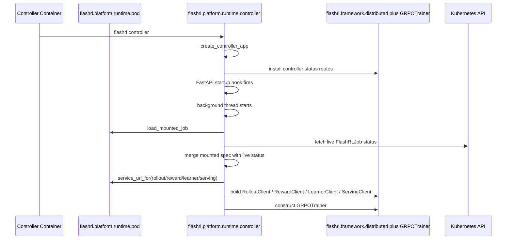

#### Execution Workflow

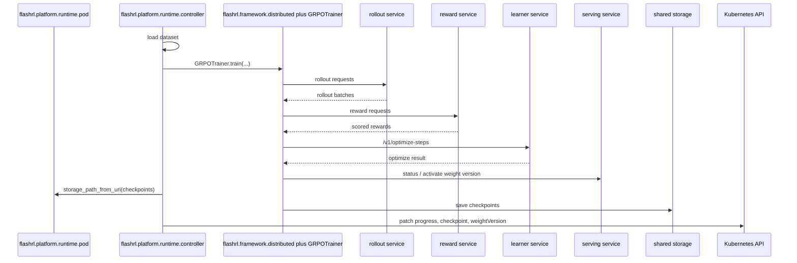

Interpretation: the controller pod is different from every other pod because it does not just expose one adapter. It starts an HTTP app for health and status, then launches a background training loop that coordinates the other services and patches job status back into Kubernetes.

### Rollout Pod

The rollout pod is an adapter-plus-hook service: platform wires the hook and remote serving client together, while the framework server owns the HTTP surface.
Kubernetes naming: `container=rollout`, workload/pod prefix=`<job>-rollout`.
Platform modules: `flashrl.platform.runtime.rollout` plus shared `flashrl.platform.runtime.pod`.

#### Init Workflow

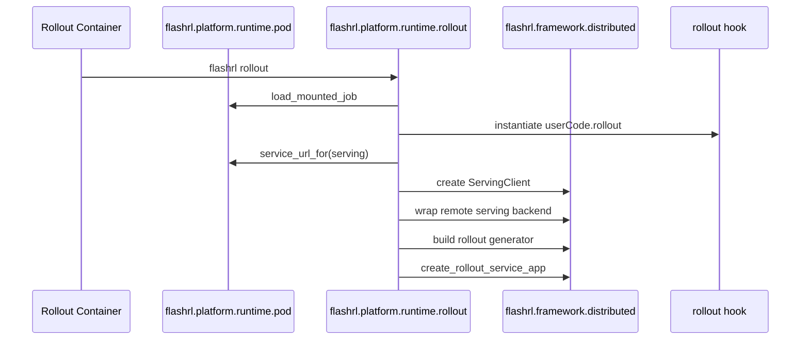

#### Execution Workflow

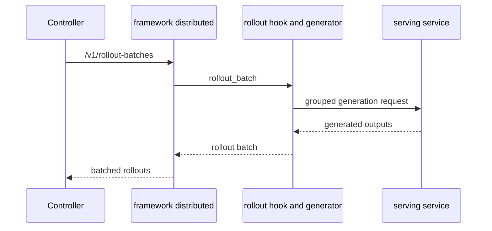

Interpretation: steady-state rollout execution is request-driven. The controller calls the rollout service, the framework server passes the request into the rollout generator, and the rollout logic calls serving remotely to produce outputs.

### Reward Pod

The reward pod is the simplest workflow: it boots one reward implementation and then scores batches on demand.
Kubernetes naming: `container=reward`, workload/pod prefix=`<job>-reward`.
Platform modules: `flashrl.platform.runtime.reward` plus shared `flashrl.platform.runtime.pod`.

#### Init Workflow

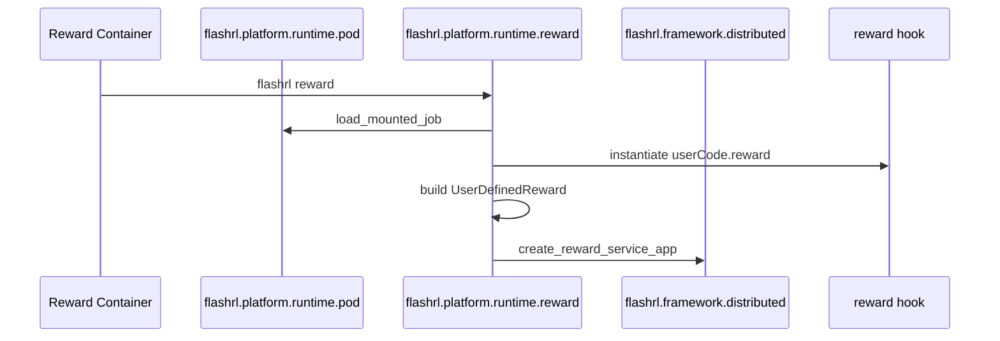

#### Execution Workflow

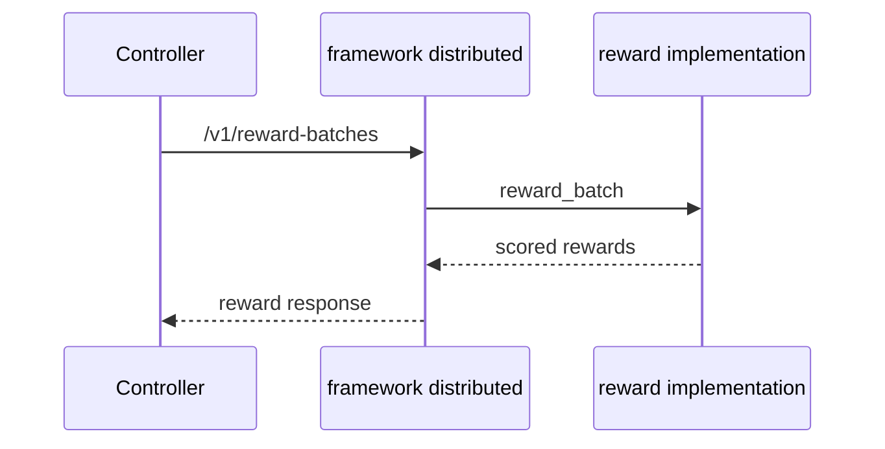

Interpretation: the reward pod is the cleanest boundary split. Platform bootstraps the reward object once, and every request after that stays on the framework server plus reward implementation path.

### Learner Pod

The learner pod is backend-driven rather than hook-driven. It boots training backends and then handles optimize and checkpoint RPCs.
Kubernetes naming: `container=learner`, workload/pod prefix=`<job>-learner`.
Platform modules: `flashrl.platform.runtime.learner` plus shared `flashrl.platform.runtime.pod`.

#### Init Workflow

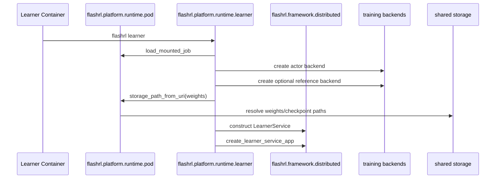

#### Execution Workflow

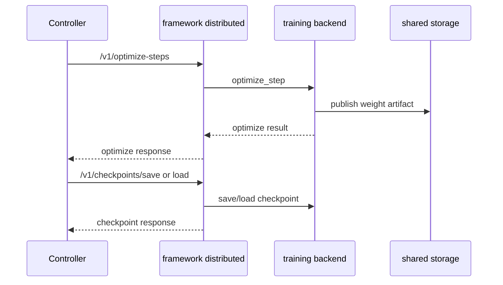

Interpretation: after startup, the learner pod is a pure RPC service around training backends. The framework server owns the HTTP contract, while the backend does optimization and writes artifacts to shared storage.

### Serving Pod

The serving pod is also backend-driven. It boots one serving backend, then handles generation and weight-activation requests.
Kubernetes naming: `container=serving`, workload/pod prefix=`<job>-serving`.
Platform modules: `flashrl.platform.runtime.serving` plus shared `flashrl.platform.runtime.pod`.

#### Init Workflow

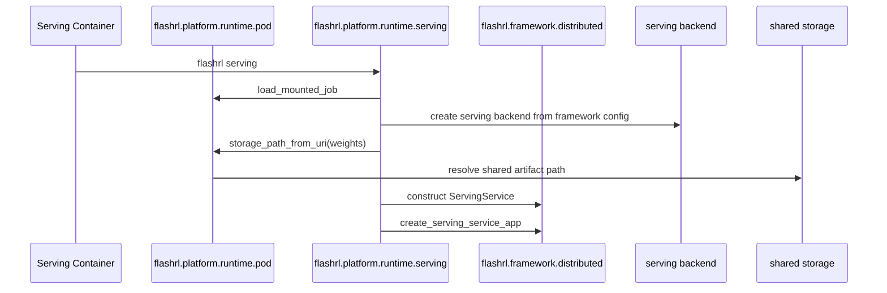

#### Execution Workflow

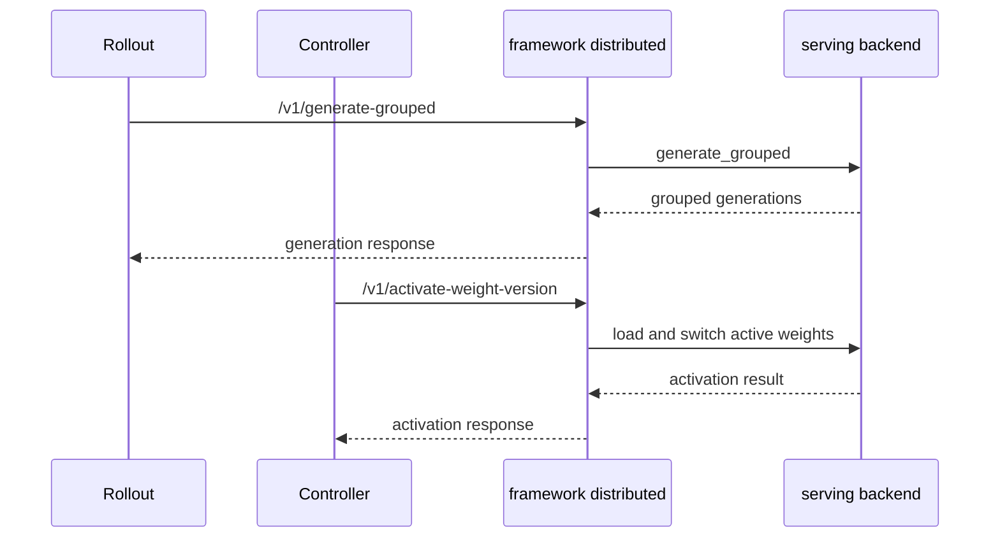

Interpretation: the serving pod spends most of its life handling two RPCs: grouped generation for rollout and active-weight switching for the controller. Platform code only matters during initialization; the steady-state path is framework server plus serving backend.

Across all five pods, the recurring pattern is stable:

- controller is orchestration-heavy
- rollout and reward are hook-heavy
- learner and serving are backend-heavy

## How Training Actually Starts

The key startup sequence is:

1. the operator is already running independently as a Kubernetes deployment
2. a `FlashRLJob` is created
3. the operator renders and applies the child workloads
4. Kubernetes starts the controller pod
5. the controller pod runs `flashrl controller`
6. the controller runtime loads the mounted `FlashRLJob`, builds HTTP clients to rollout, reward, learner, and serving, then calls into the GRPO trainer

So:

- `flashrl platform submit` or `kubectl apply -f flashrl-job.yaml` creates the job resource
- the operator deployment reacts to that resource
- the controller pod is where training actually begins

## Where To Read Next

- [flashrl/platform/README.md](../flashrl/platform/README.md) for install and run flow
- [README.md](../README.md) for the top-level Kubernetes workflow
