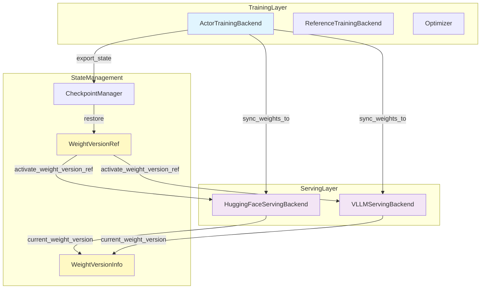
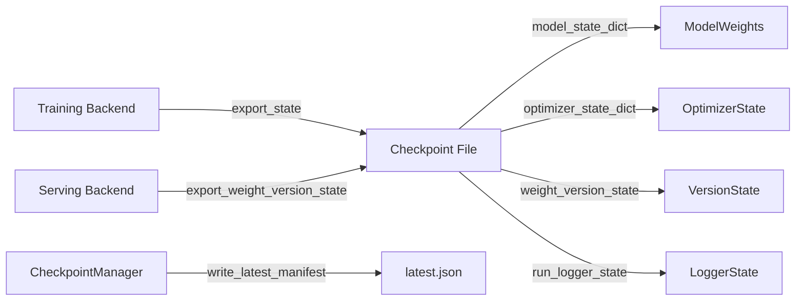
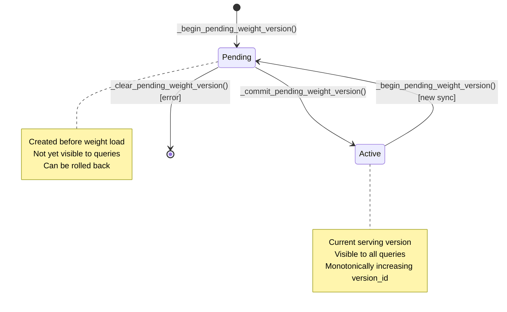

# Weight Synchronization in FlashRL

## Abstract

FlashRL implements a sophisticated weight synchronization system that enables zero-downtime updates from training backends to serving backends during reinforcement learning from human feedback (RLHF) training. This document provides a comprehensive technical overview of the architecture, components, execution workflow, and implementation details of the weight synchronization system.

## Table of Contents

1. [Architecture Overview](#architecture-overview)
2. [Component Deep Dive](#component-deep-dive)
3. [Execution Workflow](#execution-workflow)
4. [Serving Backend Comparison](#serving-backend-comparison)
5. [Checkpointing Integration](#checkpointing-integration)
6. [Thread Safety and Error Handling](#thread-safety-and-error-handling)
7. [Version Tracking](#version-tracking)
8. [Code Examples](#code-examples)

---

## Architecture Overview

### Design Goals

The weight synchronization system is built around three core design principles:

1. **Zero-Downtime Operation**: Serving backends remain available during weight updates, ensuring continuous inference capability
2. **Atomic Operations**: Weight updates are all-or-nothing, preventing partially applied states that could cause inconsistencies
3. **Version Tracking**: Comprehensive version metadata enables rollback, debugging, and audit trails

### High-Level Architecture



### System Components

The weight synchronization system consists of several interconnected components:

- **Training Backends**: Own the mutable actor model weights during training
- **Serving Backends**: Serve inference requests using synchronized weights
- **Version Management**: Tracks weight versions and their lifecycle
- **Checkpoint Manager**: Persists and restores weight state across runs

### Design Principles

1. **Separation of Concerns**: Training and serving are isolated, communicating only through well-defined sync interfaces
2. **Fail-Safe Operations**: Failed syncs trigger automatic rollback to previous stable states
3. **Thread Safety**: All operations are protected by reentrant locks to prevent race conditions
4. **Observability**: Every sync operation produces detailed metadata for monitoring and debugging

---

## Component Deep Dive

### Training Backends

#### ActorTrainingBackend

**Location**: `/Volumes/CaseSensitive/FlashRL/flashrl/framework/training/base.py` (lines 219-281)

**Purpose**: The mutable learner backend that performs gradient-based optimization and manages the actor model weights throughout training.

**Key Responsibilities**:
- Maintains the actor model and optimizer state
- Performs forward and backward passes
- Syncs updated weights to serving backends
- Exports and imports checkpoint state

**Key Methods**:

```python
def sync_weights_to(
    self,
    serving_backend: ServingBackend,
    *,
    source_training_step: int | None = None,
    source_epoch: int | None = None,
    origin: str = "sync",
) -> WeightVersionInfo:
    """Sync the backend-owned actor weights into the serving backend."""
    return serving_backend.sync_from_training_actor(
        self.model_copy,
        source_training_step=source_training_step,
        source_epoch=source_epoch,
        origin=origin,
    )
```

**Data Structures**:
- `model_copy: ActorModel` - The actor model wrapper containing the causal LM
- `optimizer: torch.optim.Optimizer` - PyTorch optimizer for gradient updates
- `learning_rate: float` - Current learning rate

#### ReferenceTrainingBackend

**Location**: `/Volumes/CaseSensitive/FlashRL/flashrl/framework/training/base.py` (lines 283-326)

**Purpose**: Frozen reference backend for stable policy evaluation during KL divergence computation.

**Key Characteristics**:
- Weights never update during training
- Optimized for inference-only operations
- Does not support weight synchronization to serving backends

**Key Methods**:

```python
def forward_logits(
    self,
    input_ids: torch.Tensor,
    attention_mask: torch.Tensor,
) -> torch.Tensor:
    """Run forward pass with torch.no_grad() for efficiency."""
    with torch.no_grad():
        return _forward_model_logits(
            self.model_copy.model,
            input_ids=input_ids,
            attention_mask=attention_mask,
        )
```

**Important**: The reference backend explicitly raises `NotImplementedError` for `sync_weights_to()`, preventing accidental synchronization.

---

### Serving Backends

#### HuggingFaceServingBackend

**Location**: `/Volumes/CaseSensitive/FlashRL/flashrl/framework/serving/huggingface.py`

**Purpose**: In-process serving backend using Hugging Face transformers, optimized for single-process deployments.

**Key Characteristics**:
- In-memory weight loading via `state_dict`
- No process restart required for updates
- Thread-safe generation with reentrant locks
- Direct model access within same process

**Key Method - Weight Synchronization**:

```python
def sync_from_training_actor(
    self,
    training_actor: ActorModel,
    *,
    source_training_step: int | None = None,
    source_epoch: int | None = None,
    origin: str = "sync",
) -> WeightVersionInfo:
    with self._lifecycle_lock:
        version_id = int(getattr(self, "_next_weight_version_id", 1))
        model_source = f"in_memory://{self.config.model_name}/version-{version_id}"
        self._begin_pending_weight_version(
            model_source=model_source,
            source_training_step=source_training_step,
            source_epoch=source_epoch,
            origin=origin,
        )
        try:
            self._actor.model.load_state_dict(training_actor.model.state_dict())
        except Exception as exc:
            self._clear_pending_weight_version(
                sync_healthy=True,
                last_sync_error=str(exc),
            )
            raise
        return self._commit_pending_weight_version()
```

**Implementation Details**:
1. Creates pending version record
2. Loads state dict directly into model
3. On failure, clears pending state and propagates exception
4. On success, commits version as active

**Thread Safety**: All operations protected by `_lifecycle_lock: threading.RLock`

#### VLLMServingBackend

**Location**: `/Volumes/CaseSensitive/FlashRL/flashrl/framework/serving/vllm/backend.py`

**Purpose**: Managed vLLM serving backend with HTTP-based weight synchronization for scalable multi-replica deployments.

**Key Characteristics**:
- Spawns and manages multiple `vllm serve` subprocess replicas
- HTTP-based weight loading via custom endpoint
- Snapshot-based weight transfer to temporary directories
- Automatic rollback on sync failures

**Replica Management**:

```python
@dataclass
class _Replica:
    """One managed `vllm serve` subprocess."""
    index: int
    port: int
    process: subprocess.Popen[str]
    model_source: str
    command: list[str]
    started_at: str = field(default_factory=utc_now_iso)
    ready_at: str | None = None
    phase: str = "Starting"
    last_error: str | None = None
    exit_code: int | None = None
```

**Key Method - Weight Synchronization**:

```python
def sync_from_training_actor(
    self,
    training_actor: ActorModel,
    *,
    source_training_step: int | None = None,
    source_epoch: int | None = None,
    origin: str = "sync",
) -> WeightVersionInfo:
    with self._lifecycle_lock:
        version_id = int(getattr(self, "_next_weight_version_id", 1))
        snapshot_dir = self._write_snapshot(training_actor, version_id=version_id)
        self._begin_pending_weight_version(
            model_source=str(snapshot_dir),
            source_training_step=source_training_step,
            source_epoch=source_epoch,
            origin=origin,
        )

        previous_sources = {
            replica.index: replica.model_source
            for replica in self._replicas
        }
        advanced_replicas: list[_Replica] = []
        try:
            for replica in self._replicas:
                replica.phase = "Syncing"
                self._request_json(
                    f"{replica.base_url}/v1/load_weights_from_disk",
                    method="POST",
                    payload={"model_source": str(snapshot_dir)},
                    timeout=60.0,
                )
                replica.model_source = str(snapshot_dir)
                replica.phase = "Ready"
                replica.last_error = None
                advanced_replicas.append(replica)
        except Exception as exc:
            # Rollback logic here
            ...
```

**Snapshot Workflow**:

1. **Write Snapshot**: Save model to temporary directory
2. **Distribute to Replicas**: HTTP POST to each replica's load endpoint
3. **Track Progress**: Maintain list of successfully updated replicas
4. **Rollback on Failure**: Restore previous model source to failed replicas
5. **Commit on Success**: Mark new version as active and cleanup old snapshots

**Snapshot Implementation**:

```python
def _write_snapshot(self, training_actor: ActorModel, *, version_id: int) -> Path:
    snapshot_root = self._ensure_snapshot_dir()
    final_dir = snapshot_root / f"version-{version_id:08d}"
    if final_dir.exists():
        raise RuntimeError(f"Managed vllm snapshot version already exists: {final_dir}")

    temp_dir = snapshot_root / f".version-{version_id:08d}.{uuid4().hex}.tmp"
    shutil.rmtree(temp_dir, ignore_errors=True)
    temp_dir.mkdir(parents=True, exist_ok=True)
    training_actor.model.save_pretrained(temp_dir, safe_serialization=True)
    training_actor.tokenizer.save_pretrained(temp_dir)
    self._fsync_tree(temp_dir)
    os.replace(temp_dir, final_dir)
    self._fsync_dir(snapshot_root)
    return final_dir
```

**Atomic Operations**: Uses atomic file system operations (`os.replace`) and `fsync` to ensure crash-safe snapshot creation.

---

### CheckpointManager

**Location**: `/Volumes/CaseSensitive/FlashRL/flashrl/framework/checkpointing.py`

**Purpose**: Manages checkpoint lifecycle, including interval checkpoints, final checkpoints, and resume functionality.

**Key Responsibilities**:
- Resolves checkpoint paths from configuration
- Manages "latest" checkpoint manifest
- Validates checkpoint metadata for resume operations
- Coordinates between training and serving state

**Key Methods**:

```python
def interval_checkpoint_path(self, *, run_dir: Path, step: int) -> Path:
    """Return the path for one managed interval checkpoint."""
    directory = self.checkpoint_directory(run_dir=run_dir)
    return directory / f"step-{step:08d}.pt"

def latest_manifest_path(self, *, run_dir: Path) -> Path:
    """Return the path for the managed latest-checkpoint manifest."""
    return self.checkpoint_directory(run_dir=run_dir) / "latest.json"

def build_restored_checkpoint(
    self,
    *,
    checkpoint_path: Path,
    checkpoint_metadata: dict[str, Any] | None,
) -> RestoredCheckpoint:
    """Validate the metadata required for managed append-resume."""
    # Validation logic here
    ...
```

**Integration with Weight Sync**:
- Checkpoints include serving weight version state
- Resume operations restore version ID monotonicity
- Manifest tracks which checkpoint corresponds to which weight version

---

### WeightVersionInfo

**Location**: `/Volumes/CaseSensitive/FlashRL/flashrl/framework/data_models.py` (lines 57-66)

**Purpose**: Immutable data structure representing one active or pending serving weight version.

**Schema**:

```python
class WeightVersionInfo(BaseModel):
    """One activated or pending serving-weight version."""

    version_id: int
    source_training_step: int | None = None
    source_epoch: int | None = None
    activated_at: str | None = None
    model_source: str
    origin: Literal["startup", "sync", "resume"]
```

**Field Descriptions**:
- `version_id`: Monotonically increasing version identifier
- `source_training_step`: Training step that produced these weights (if applicable)
- `source_epoch`: Training epoch that produced these weights (if applicable)
- `activated_at`: ISO timestamp of when version became active
- `model_source`: URI or path identifying the weight source
- `origin`: How the version was created (startup load, training sync, or checkpoint resume)

**Origin Types**:
- `"startup"`: Initial model loaded from configuration
- `"sync"`: Synchronized from training actor after optimization step
- `"resume"`: Restored from checkpoint during training resumption

---

## Execution Workflow

### Step-by-Step Sequence

The weight synchronization workflow integrates into the GRPO training loop as follows:

```mermaid
sequenceDiagram
    participant Trainer as GRPOTrainer
    participant Actor as ActorTrainingBackend
    participant Serving as ServingBackend
    participant Rollout as RolloutGenerator
    participant Learner as LearnerService

    Note over Trainer: Training Step Begins
    Trainer->>Rollout: Generate rollouts with current weights
    Rollout-->>Trainer: Rollouts (with weight_version metadata)

    Trainer->>Learner: optimize_step(learner_batch)
    Note over Learner: Actor Forward + Backward
    Learner->>Actor: backward_step(loss)
    Actor->>Actor: optimizer.step()
    Note over Actor: Weights updated in-place

    Learner->>Actor: sync_weights_to(serving_backend)
    Note over Actor: Extract state_dict
    Actor->>Serving: sync_from_training_actor(actor_model)
    Note over Serving: Begin pending version
    Note over Serving: Load new weights
    Note over Serving: Commit version (or rollback on error)
    Serving-->>Actor: WeightVersionInfo

    Serving-->>Learner: weight_version
    Learner-->>Trainer: OptimizeStepResponse (with weight_version)

    Trainer->>Serving: activate_weight_version(version_ref)
    Note over Serving: Update active version
    Serving-->>Trainer: ActiveWeightVersion

    Note over Trainer: Step complete, serving using new weights
```

### Integration with GRPOTrainer

**Location**: `/Volumes/CaseSensitive/FlashRL/flashrl/framework/trainer/grpo/trainer.py`

The trainer orchestrates weight synchronization through the `_optimize_batch` method (lines 526-601):

```python
def _optimize_batch(
    self,
    learner_batch: LearnerBatch,
    context: StepContext | None,
    *,
    rollout_weight_version: WeightVersionInfo | None,
) -> OptimizationResult:
    """Delegate learner-side tensor work to the training backend."""
    optimize_response = self.learner.optimize_step(
        OptimizeStepRequest(
            step_id=(context.step if context is not None else None),
            epoch=(context.epoch if context is not None else 0),
            learner_batch=learner_batch,
            rollout_weight_version=rollout_weight_version,
        )
    )
    result = OptimizationResult(...)

    # Weight synchronization happens inside optimize_step
    activation_response, sync_seconds = timed_call(
        lambda: self.serving.activate_weight_version(
            ActivateWeightVersionRequest(
                step_id=(context.step if context is not None else None),
                weight_version=optimize_response.weight_version,
            )
        )
    )
    ...
```

### Timing and Performance Considerations

**HuggingFace Backend**:
- Sync latency: ~10-100ms depending on model size
- Memory overhead: Minimal (in-memory state dict transfer)
- Scalability: Limited to single process

**vLLM Backend**:
- Sync latency: ~1-5s depending on model size and replica count
- Memory overhead: Temporary snapshot directory (2x model size)
- Scalability: Linear with replica count (parallel HTTP requests)

**Optimization Opportunities**:
- Weight sync happens in parallel with other post-step operations
- Pending version creation is lightweight (metadata only)
- Failed syncs don't block training (rollback and continue)

### Rollout Metadata Integration

Each rollout includes weight version metadata for traceability:

```python
def _build_batch_metadata(self, rollouts: list[Any]) -> dict[str, Any]:
    """Capture batch-wide rollout provenance and reject mixed serving versions."""
    normalized_versions = []
    for rollout in rollouts:
        payload = _weight_version_payload(rollout)
        if payload:
            normalized_versions.append(payload)

    if not normalized_versions:
        return {}

    canonical = normalized_versions[0]
    if any(payload != canonical for payload in normalized_versions[1:]):
        raise RuntimeError("Rollout batch mixed multiple serving weight versions.")
    return {
        "weight_version": canonical,
    }
```

This ensures that rollouts are always associated with the specific weight version that generated them, enabling:

- Debugging with version-aware logs
- Reproducibility analysis
- Training stability monitoring

---

## Serving Backend Comparison

### Weight Transfer Mechanism

| Aspect | HuggingFace Backend | vLLM Backend |
|--------|---------------------|--------------|
| **Transfer Method** | In-memory `state_dict` load | HTTP POST + disk snapshot |
| **Process Scope** | Same process | Cross-process (HTTP) |
| **Restart Required** | No | No |
| **Network I/O** | None | HTTP to localhost |
| **Disk I/O** | None | Snapshot write + read |

### Scalability Considerations

**HuggingFace Backend**:
- Single-process limitation
- CPU/GPU bound on one machine
- Ideal for development and small-scale training
- Limited by Python GIL for concurrent generation

**vLLM Backend**:
- Multi-replica scaling
- Horizontal scaling across GPUs
- Production-ready for high-throughput serving
- Parallel generation across replicas

### Failure Handling and Rollback

**HuggingFace Backend**:
```python
try:
    self._actor.model.load_state_dict(training_actor.model.state_dict())
except Exception as exc:
    self._clear_pending_weight_version(
        sync_healthy=True,
        last_sync_error=str(exc),
    )
    raise
return self._commit_pending_weight_version()
```

- Simple exception handling
- Model remains in previous state on failure
- No complex rollback needed (in-memory operation)

**vLLM Backend**:
```python
except Exception as exc:
    rollback_error: Exception | None = None
    for replica in advanced_replicas:
        previous_source = previous_sources[replica.index]
        try:
            self._request_json(
                f"{replica.base_url}/v1/load_weights_from_disk",
                method="POST",
                payload={"model_source": previous_source},
                timeout=60.0,
            )
            replica.model_source = previous_source
            replica.phase = "Ready"
            replica.last_error = None
        except Exception as rollback_exc:
            rollback_error = rollback_exc
            replica.phase = "Failed"
            replica.last_error = (
                f"Rollback failed after sync error: {rollback_exc}"
            )
```

- Complex multi-replica rollback
- Attempts to restore all replicas to previous state
- Marks failed replicas if rollback fails
- Critical error if both sync and rollback fail

### Performance Characteristics

**HuggingFace Backend**:
- **Latency**: Low (10-100ms)
- **Throughput**: Limited by single process
- **Memory**: Base model size only
- **CPU**: Single process utilization
- **Best For**: Development, testing, small-scale training

**vLLM Backend**:
- **Latency**: Medium (1-5s)
- **Throughput**: Scales with replica count
- **Memory**: 2x model size during sync (snapshot)
- **CPU**: Multi-process parallel
- **Best For**: Production, large-scale training, high-throughput serving

---

## Checkpointing Integration

### State Preservation Across Runs

The weight synchronization system integrates deeply with checkpointing to preserve version state:

**Checkpoint Save Flow**:



**Key Components**:

1. **Training State**: Actor model weights + optimizer state
2. **Serving State**: Active weight version metadata + next version ID
3. **Run State**: Epoch, step, metrics, logger state

### Version ID Monotonicity

The system ensures version IDs remain monotonic across checkpoint resume:

```python
def restore_weight_version_state(self, state: dict[str, Any] | None) -> None:
    """Restore the next version id from checkpoint metadata before a resume sync."""
    if not isinstance(state, dict):
        return
    raw_next_version_id = state.get("next_version_id")
    if not isinstance(raw_next_version_id, int):
        return
    current_active = getattr(self, "_active_weight_version", None)
    minimum_next_version_id = (
        current_active.version_id + 1 if isinstance(current_active, WeightVersionInfo) else 0
    )
    self._next_weight_version_id = max(int(raw_next_version_id), int(minimum_next_version_id))
```

**Why This Matters**:
- Prevents version ID collisions after resume
- Maintains accurate provenance tracking
- Enables correct rollback behavior

### Resume Workflow

1. **Load Checkpoint**: Restore training and serving state
2. **Restore Version State**: Set `_next_weight_version_id` from checkpoint
3. **Initial Sync**: Sync training weights to serving with `origin="resume"`
4. **Continue Training**: Version IDs increment from restored base

**Example Resume Flow**:

```python
# Before checkpoint: active version 5, next version ID 6
checkpoint = {
    "weight_version_state": {
        "next_version_id": 6,
        "active_weight_version": {
            "version_id": 5,
            ...
        }
    }
}

# After resume and first sync
# New active version: 6 (origin="resume")
# Next version ID: 7

# Subsequent training syncs
# Active version: 7, 8, 9, ... (origin="sync")
```

---

## Thread Safety and Error Handling

### Locking Mechanisms

Both serving backends use reentrant locks (`threading.RLock`) to protect lifecycle operations:

**HuggingFace Backend**:

```python
def __init__(self, config: ServingConfig, ...) -> None:
    ...
    self._lifecycle_lock = threading.RLock()
    ...

def generate(self, prompts: list[str], **kwargs: Any) -> list[str]:
    with self._lifecycle_lock:
        return self._actor.generate(prompts, **kwargs)

def sync_from_training_actor(self, training_actor: ActorModel, ...) -> WeightVersionInfo:
    with self._lifecycle_lock:
        # Version state modifications
        ...
```

**vLLM Backend**:

```python
def __init__(self, config: ServingConfig, ...) -> None:
    ...
    self._lifecycle_lock = RLock()
    ...

def generate_grouped(self, prompts: list[str], group_size: int, ...) -> list[list[GeneratedSample]]:
    with self._lifecycle_lock:
        # Generation logic
        ...
```

**Protected Operations**:
- Weight synchronization
- Version state changes
- Model loading/unloading
- Replica lifecycle management

### Atomic Operations

**Version State Transitions**:

```python
def _commit_pending_weight_version(self) -> WeightVersionInfo:
    """Activate the currently pending serving version."""
    pending = getattr(self, "_pending_weight_version", None)
    if not isinstance(pending, WeightVersionInfo):
        raise RuntimeError("No pending weight version is available to activate.")
    activated = pending.model_copy(update={"activated_at": utc_now_iso()})
    self._active_weight_version = activated
    self._pending_weight_version = None
    self._next_weight_version_id = activated.version_id + 1
    self._last_successful_sync_at = activated.activated_at
    self._sync_healthy = True
    self._last_sync_error = None
    return activated.model_copy(deep=True)
```

**Atomicity Guarantees**:
1. Version state changes are all-or-nothing
2. Pending version must exist before commit
3. State updates happen under lock protection
4. No intermediate states visible to callers

### Error Recovery Strategies

**Strategy 1: Clear and Propagate**

Used by HuggingFace backend for recoverable errors:

```python
try:
    self._actor.model.load_state_dict(training_actor.model.state_dict())
except Exception as exc:
    self._clear_pending_weight_version(
        sync_healthy=True,
        last_sync_error=str(exc),
    )
    raise
```

**Strategy 2: Rollback and Fail**

Used by vLLM backend for multi-replica synchronization:

```python
except Exception as exc:
    rollback_error: Exception | None = None
    for replica in advanced_replicas:
        previous_source = previous_sources[replica.index]
        try:
            self._request_json(
                f"{replica.base_url}/v1/load_weights_from_disk",
                method="POST",
                payload={"model_source": previous_source},
                timeout=60.0,
            )
            replica.model_source = previous_source
            ...
        except Exception as rollback_exc:
            rollback_error = rollback_exc
            ...
    if rollback_error is None:
        self._clear_pending_weight_version(
            sync_healthy=True,
            last_sync_error=failure_message,
        )
        raise RuntimeError(failure_message) from exc
    else:
        self._clear_pending_weight_version(
            sync_healthy=False,
            last_sync_error=rollback_message,
        )
        raise RuntimeError(rollback_message) from exc
```

**Strategy 3: Graceful Degradation**

Used when optional operations fail:

```python
def set_live_rollout_debug(self, callback: Any, context: dict[str, Any]) -> None:
    if not self.config.debug_live_rollout:
        return
    self._actor.set_live_rollout_debug(callback, context)
```

---

## Version Tracking

### WeightVersionInfo Lifecycle



### State Export and Import

**Export for Checkpoint**:

```python
def export_weight_version_state(self) -> dict[str, Any]:
    """Serialize the minimum state required to keep version ids monotonic."""
    active = getattr(self, "_active_weight_version", None)
    next_version_id = getattr(self, "_next_weight_version_id", None)
    if next_version_id is None:
        if isinstance(active, WeightVersionInfo):
            next_version_id = active.version_id + 1
        else:
            next_version_id = 0
    return {
        "schema_version": 1,
        "next_version_id": int(next_version_id),
        "active_weight_version": (
            active.model_dump() if isinstance(active, WeightVersionInfo) else None
        ),
        "last_successful_sync_at": getattr(self, "_last_successful_sync_at", None),
    }
```

**Import on Resume**:

```python
def restore_weight_version_state(self, state: dict[str, Any] | None) -> None:
    """Restore the next version id from checkpoint metadata before a resume sync."""
    if not isinstance(state, dict):
        return
    raw_next_version_id = state.get("next_version_id")
    if not isinstance(raw_next_version_id, int):
        return
    current_active = getattr(self, "_active_weight_version", None)
    minimum_next_version_id = (
        current_active.version_id + 1 if isinstance(current_active, WeightVersionInfo) else 0
    )
    self._next_weight_version_id = max(int(raw_next_version_id), int(minimum_next_version_id))
```

### Admin and Monitoring

**Status Query**:

```python
def weight_sync_status(self) -> dict[str, Any]:
    """Return admin-facing sync/version state when available."""
    active = getattr(self, "_active_weight_version", None)
    pending = getattr(self, "_pending_weight_version", None)
    return {
        "activeWeightVersion": (
            active.model_dump() if isinstance(active, WeightVersionInfo) else None
        ),
        "pendingWeightVersion": (
            pending.model_dump() if isinstance(pending, WeightVersionInfo) else None
        ),
        "lastSuccessfulSyncAt": getattr(self, "_last_successful_sync_at", None),
        "syncHealthy": bool(getattr(self, "_sync_healthy", active is not None)),
        "lastSyncError": getattr(self, "_last_sync_error", None),
    }
```

**Admin Integration**:

vLLM replicas expose sync status in admin objects:

```python
items.append(
    build_admin_object(
        "VLLMInstance",
        f"vllm-instance-{replica.index}",
        uid=f"vllm:{self.config.model_name}:{replica.index}",
        created_at=replica.started_at,
        labels={
            "flashrl.dev/serving-backend": "vllm",
            "flashrl.dev/model-name": self.config.model_name,
        },
        spec={
            "replicaIndex": replica.index,
            "host": "127.0.0.1",
            "port": replica.port,
            "modelSource": replica.model_source,
            ...
        },
        status={
            "phase": phase,
            "healthy": phase == "Ready" and exit_code is None,
            "activeWeightVersion": sync_status.get("activeWeightVersion"),
            "pendingWeightVersion": sync_status.get("pendingWeightVersion"),
            "lastSuccessfulSyncAt": sync_status.get("lastSuccessfulSyncAt"),
            "syncHealthy": sync_status.get("syncHealthy"),
            "lastSyncError": sync_status.get("lastSyncError"),
        },
    )
)
```

---

## Code Examples

### Weight Sync Method Signatures

**Training Backend → Serving Backend**:

```python
# File: flashrl/framework/training/base.py
def sync_weights_to(
    self,
    serving_backend: ServingBackend,
    *,
    source_training_step: int | None = None,
    source_epoch: int | None = None,
    origin: str = "sync",
) -> WeightVersionInfo:
    """Sync the backend-owned actor weights into the serving backend.

    Args:
        serving_backend: Target serving backend for weight synchronization
        source_training_step: Training step that produced the weights (for provenance)
        source_epoch: Training epoch that produced the weights (for provenance)
        origin: Origin marker ("sync" for training updates, "resume" for checkpoint restore)

    Returns:
        WeightVersionInfo describing the newly activated serving version

    Raises:
        RuntimeError: If weight synchronization fails
    """
    return serving_backend.sync_from_training_actor(
        self.model_copy,
        source_training_step=source_training_step,
        source_epoch=source_epoch,
        origin=origin,
    )
```

**Serving Backend (Base)**:

```python
# File: flashrl/framework/serving/base.py
@abstractmethod
def sync_from_training_actor(
    self,
    training_actor: ActorModel,
    *,
    source_training_step: int | None = None,
    source_epoch: int | None = None,
    origin: str = "sync",
) -> WeightVersionInfo:
    """Refresh the serving copy from the training actor.

    Args:
        training_actor: Actor model containing updated weights
        source_training_step: Training step that produced the weights
        source_epoch: Training epoch that produced the weights
        origin: Origin marker for version tracking

    Returns:
        WeightVersionInfo for the newly activated version

    Raises:
        RuntimeError: If weight loading or activation fails
    """
```

### Version Tracking Patterns

**Initialize Version State**:

```python
# File: flashrl/framework/serving/base.py
def _initialize_weight_version(
    self,
    *,
    model_source: str,
    origin: str = "startup",
) -> WeightVersionInfo:
    """Initialize serving version state after backend startup."""
    activated_at = utc_now_iso()
    active = WeightVersionInfo(
        version_id=0,
        source_training_step=None,
        source_epoch=None,
        activated_at=activated_at,
        model_source=str(model_source),
        origin=origin,
    )
    self._active_weight_version = active
    self._pending_weight_version = None
    self._next_weight_version_id = 1
    self._last_successful_sync_at = activated_at
    self._sync_healthy = True
    self._last_sync_error = None
    return active.model_copy(deep=True)
```

**Begin Pending Version**:

```python
# File: flashrl/framework/serving/base.py
def _begin_pending_weight_version(
    self,
    *,
    model_source: str,
    source_training_step: int | None,
    source_epoch: int | None,
    origin: str,
) -> WeightVersionInfo:
    """Create one pending serving version before activation."""
    pending = WeightVersionInfo(
        version_id=int(getattr(self, "_next_weight_version_id", 0)),
        source_training_step=source_training_step,
        source_epoch=source_epoch,
        activated_at=None,
        model_source=str(model_source),
        origin=origin,
    )
    self._pending_weight_version = pending
    return pending.model_copy(deep=True)
```

**Commit Pending Version**:

```python
# File: flashrl/framework/serving/base.py
def _commit_pending_weight_version(self) -> WeightVersionInfo:
    """Activate the currently pending serving version."""
    pending = getattr(self, "_pending_weight_version", None)
    if not isinstance(pending, WeightVersionInfo):
        raise RuntimeError("No pending weight version is available to activate.")
    activated = pending.model_copy(update={"activated_at": utc_now_iso()})
    self._active_weight_version = activated
    self._pending_weight_version = None
    self._next_weight_version_id = activated.version_id + 1
    self._last_successful_sync_at = activated.activated_at
    self._sync_healthy = True
    self._last_sync_error = None
    return activated.model_copy(deep=True)
```

### Error Handling Patterns

**Clear Pending on Error**:

```python
# File: flashrl/framework/serving/base.py
def _clear_pending_weight_version(
    self,
    *,
    sync_healthy: bool,
    last_sync_error: str | None,
) -> None:
    """Clear pending sync state after a failed or rolled-back attempt."""
    self._pending_weight_version = None
    self._sync_healthy = bool(sync_healthy)
    self._last_sync_error = last_sync_error
```

**Usage in HuggingFace Backend**:

```python
# File: flashrl/framework/serving/huggingface.py
def sync_from_training_actor(
    self,
    training_actor: ActorModel,
    *,
    source_training_step: int | None = None,
    source_epoch: int | None = None,
    origin: str = "sync",
) -> WeightVersionInfo:
    with self._lifecycle_lock:
        version_id = int(getattr(self, "_next_weight_version_id", 1))
        model_source = f"in_memory://{self.config.model_name}/version-{version_id}"
        self._begin_pending_weight_version(
            model_source=model_source,
            source_training_step=source_training_step,
            source_epoch=source_epoch,
            origin=origin,
        )
        try:
            self._actor.model.load_state_dict(training_actor.model.state_dict())
        except Exception as exc:
            self._clear_pending_weight_version(
                sync_healthy=True,
                last_sync_error=str(exc),
            )
            raise
        return self._commit_pending_weight_version()
```

**Usage in vLLM Backend (with rollback)**:

```python
# File: flashrl/framework/serving/vllm/backend.py
try:
    for replica in self._replicas:
        replica.phase = "Syncing"
        self._request_json(
            f"{replica.base_url}/v1/load_weights_from_disk",
            method="POST",
            payload={"model_source": str(snapshot_dir)},
            timeout=60.0,
        )
        replica.model_source = str(snapshot_dir)
        replica.phase = "Ready"
        replica.last_error = None
        advanced_replicas.append(replica)
except Exception as exc:
    rollback_error: Exception | None = None
    for replica in advanced_replicas:
        previous_source = previous_sources[replica.index]
        try:
            self._request_json(
                f"{replica.base_url}/v1/load_weights_from_disk",
                method="POST",
                payload={"model_source": previous_source},
                timeout=60.0,
            )
            replica.model_source = previous_source
            replica.phase = "Ready"
            replica.last_error = None
        except Exception as rollback_exc:
            rollback_error = rollback_exc
            replica.phase = "Failed"
            replica.last_error = (
                f"Rollback failed after sync error: {rollback_exc}"
            )
    failure_message = f"Failed to load weights into vllm replicas: {exc}"
    if rollback_error is None:
        self._clear_pending_weight_version(
            sync_healthy=True,
            last_sync_error=failure_message,
        )
        self._remove_snapshot_dir(snapshot_dir)
        raise RuntimeError(failure_message) from exc
    rollback_message = (
        f"{failure_message}. Rollback also failed: {rollback_error}"
    )
    self._clear_pending_weight_version(
        sync_healthy=False,
        last_sync_error=rollback_message,
    )
    raise RuntimeError(rollback_message) from exc
```

---

## References

### Key Files

- **Training Backends**: `/Volumes/CaseSensitive/FlashRL/flashrl/framework/training/base.py`
- **Serving Base**: `/Volumes/CaseSensitive/FlashRL/flashrl/framework/serving/base.py`
- **HuggingFace Serving**: `/Volumes/CaseSensitive/FlashRL/flashrl/framework/serving/huggingface.py`
- **vLLM Serving**: `/Volumes/CaseSensitive/FlashRL/flashrl/framework/serving/vllm/backend.py`
- **Checkpoint Manager**: `/Volumes/CaseSensitive/FlashRL/flashrl/framework/checkpointing.py`
- **Data Models**: `/Volumes/CaseSensitive/FlashRL/flashrl/framework/data_models.py`
- **GRPO Trainer**: `/Volumes/CaseSensitive/FlashRL/flashrl/framework/trainer/grpo/trainer.py`
- **Distributed Models**: `/Volumes/CaseSensitive/FlashRL/flashrl/framework/distributed/models.py`

### Related Documentation

- FlashRL Architecture Overview
- Checkpointing and Resume Guide
- Serving Backend Configuration
- GRPO Training Algorithm

### Version History

- Schema Version 1: Initial weight version state format
- Checkpoint Schema Version 4: Current checkpoint format with weight version support

---

**Document Version**: 1.0
**Last Updated**: 2025-03-20
**Maintainer**: FlashRL Framework Team
